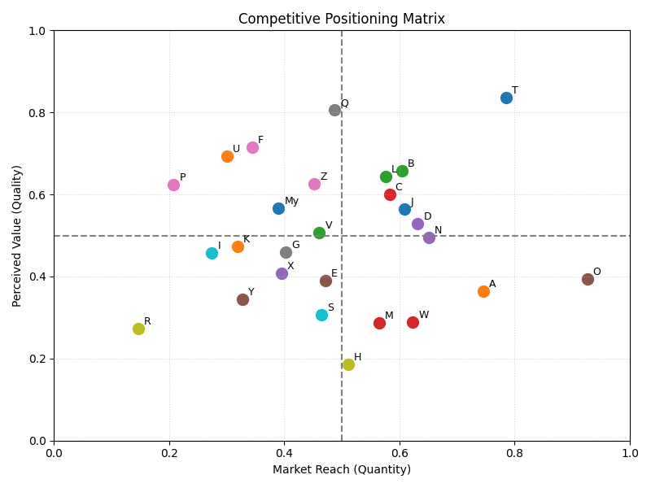
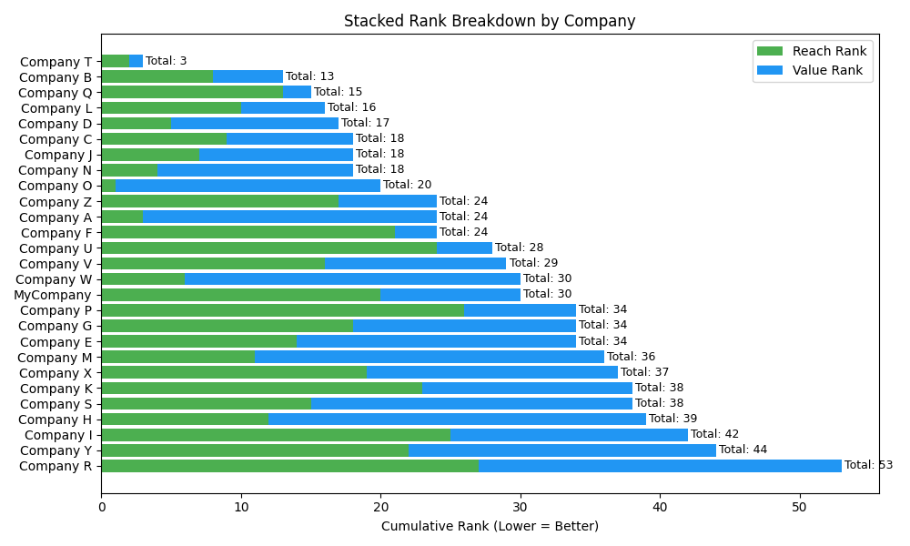

# Competitive Positioning Matrix  
**Understanding Strategic Placement Through Reach and Value**

---

## Problem

In a competitive landscape, it’s not enough to simply operate at scale — companies must also deliver perceived value to customers in order to build loyalty and defend market share. The challenge lies in understanding not only **where a company stands** compared to others, but **why** it stands there — and what can be done to move it.

---

## Process

This project uses a **simulated dataset** to analyze and visualize competitive positioning through two core dimensions:

- **Market Reach** — a composite of product count, global presence, revenue, and price accessibility
- **Perceived Value** — a composite of NPS score, brand buzz, and customer experience rating

Steps:
1. Generate and clean data
2. Engineer normalized features
3. Build two strategic dimensions
4. Visualize results using a 2D positioning matrix and ranked comparison chart

---

### Competitive Positioning Matrix  

---

### Strategic Ranking Breakdown  

---

## Insight

**My Company** is positioned squarely in the **middle of the competitive field**. Its **Market Reach outweighs its Perceived Value by a factor of 2.5**, indicating that while the company has successfully scaled its presence, it has yet to achieve proportional differentiation in the eyes of customers.

---

## Final Recommendation

To move into the **top 3 strategic performers**, we recommend a **30/70 resource split**:
- Allocate **30%** of effort to maintaining and modestly expanding Market Reach
- Allocate **70%** toward improving Perceived Value, by:
  - Enhancing customer experience (CX)
  - Strengthening brand messaging and trust
  - Boosting loyalty and advocacy (NPS)

This rebalancing effort will help shift the company upward on the value axis — turning reach into defensible advantage.

---